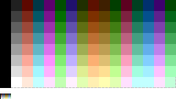

# plus4playground

Plus/4 programming playground. Examples, code fragments, etc.

# Palette #

# Links #

 * http://www.cbmhardware.de/show.php?r=4&id=13/Commodore%20plus/4%20and%20Commodore%2016%20Memory%20Map
 * http://mclauchlan.site.net.au/scott/C=Hacking/C-Hacking12/gfx.html
 * http://www.zimmers.net/anonftp/pub/cbm/plus4/
 * https://www.floodgap.com/retrobits/ckb/secret/x64.html
 * https://hackaday.io/project/11460-fpgated/details

